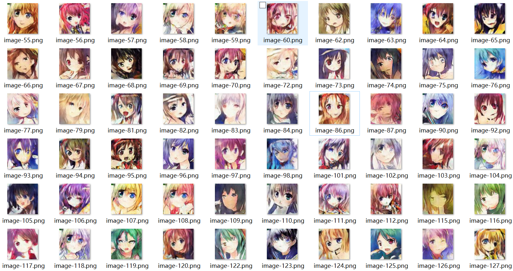

# 项目简介 :clipboard:
该项目是利用DCGAN生成你想要的图片，我使用了3个图集进行训练，分别是鲜花、celeba人脸、动漫头像。 

项目一共有三个py文件，功能如下：network.py是实现DCGAN的神经网络结构，train.py是训练过程，generate.py是利用训练好的模型参数生成图片。  
每一个py文件中都有详细的注释说明。

整个项目过程中大概进行了100多次调参优化，我个人感觉最终的效果还不错，如果大佬们有更好的优化方案欢迎Pull requests或者在Issues里面讨论。

# 资源获取 :eyes:
鲜花图集我已经上传在我的百度网盘上，下载地址：[https://pan.baidu.com/s/1uvU61kB-xPowufwVU8Vzqg](https://pan.baidu.com/s/1uvU61kB-xPowufwVU8Vzqg)，提取码：een8  

celeba人脸图集是由香港中文大学开源的，可以在官网进行下载，官网地址：[http://mmlab.ie.cuhk.edu.hk/projects/CelebA.html](http://mmlab.ie.cuhk.edu.hk/projects/CelebA.html)  

动漫头像图集是网友开源在百度网盘上的，下载地址：[https://pan.baidu.com/share/init?surl=eSifHcA](https://pan.baidu.com/share/init?surl=eSifHcA)，提取码：g5qa  

使用的服务器资源获取地址：[https://www.yousanai.cn/home](https://www.yousanai.cn/home)

# 训练结果 :bulb:
鲜花图集训练500轮的结果如下：

celeba人脸图集训练500轮的结果如下：

动漫头像图集训练500轮的结果如下：

# 补充说明 :key:
**首先对使用的图集信息进行一些补充说明：**    
鲜花图集大概是3000张，图片尺寸是64×64；动漫头像图集大概是5万张，图片尺寸是96×96。  

对于celeba人脸图集这里单独说一下，官方给了20万张，但是如果全部拿来使用会导致训练时间过长，所以这里只用了2万张。同时，原尺寸为178×218，这不利于构造神经网络模型，我将它处理为了128×160的尺寸，既保证模型构造起来容易，又保证图片比例不失调。  

因为训练不同尺寸的图集需要对神经网络模型进行修改（也就是修改network.py)，为了防止一些人不会修改，这里我将对应不同尺寸图集的network.py也上传了，放在extra文件夹下面。首页放的network.py是针对96×96尺寸的，可以用来训练动漫头像图集。  

同时我也将修改图片尺寸的handle_images.py文件上传到了extra文件夹下面。

**接下来对训练过程进行一些补充说明：**    
在我的代码中你可以看到，在每一个epoch的每一个step中我都打印出了生成器和判别器的loss。在超过100次的训练过程中，我发现生成器的loss在2-4之间，判别器的loss在0.5左右时，生成的效果最好。  

并且如果你想和我一样训练500轮甚至更多，那么你不可能使用自己的电脑（当然，排除几万的台式机），必须使用服务器。我使用服务器训练celeba人脸500轮大概花了40个小时（服务器配置是Rtx2080Ti显卡），看到这你应该明白为什么必须使用服务器了吧。  

最后祝大家都能训练出好的结果。（练出好丹） :grin:
